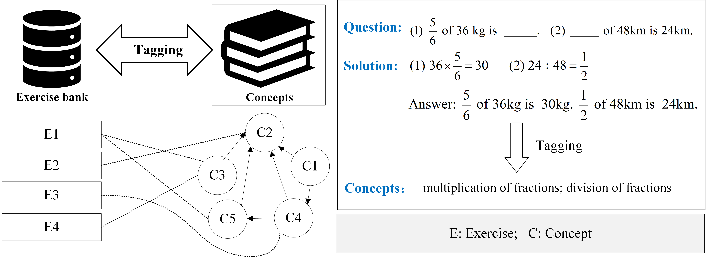

# Response Speed Enhanced Fine-grained Knowledge Tracing: A Multi-task Learning Perspective
The code is related to the paper [PQSCT: Pseudo-Siamese BERT for Concept Tagging With Both Questions and Solutions](https://ieeexplore.ieee.org/abstract/document/10123979).

# Overview

The global outbreak of the new coronavirus epidemic has promoted the development of intelligent education and the utilization of online learning systems. In order to provide students with intelligent services such as cognitive diagnosis and personalized exercises recommendation, a fundamental task is the concept tagging for exercises, which extracts knowledge index structures and knowledge representations for exercises. Unfortunately, to the best of our knowledge, existing tagging approaches based on exercise content either ignore multiple components of exercises, or ignore that exercises may contain multiple concepts. To this end, in this paper, we present a study of concept tagging. First, we propose an improved pre-trained BERT for concept tagging with both questions and solutions (QSCT). Specifically, we design a question-solution prediction task and apply the BERT encoder to combine questions and solutions, ultimately obtaining the final exercise representation through feature augmentation. Then, to further explore the relationship between questions and solutions, we extend the QSCT to a pseudo-siamese BERT for concept tagging with both questions and solutions (PQSCT). We optimize the feature fusion strategy, which integrates five different vector features from local and global into the final exercise representation. Finally, we conduct extensive experiments on real-world datasets, which clearly demonstrate the effectiveness of our proposed models for concept tagging.

# Requirements

- tensorflow
- keras
- keras_bert

## Datasets
We have made our dataset public. If our dataset is helpful to your research, please cite our paper.

## Train
```
python -u PQSCT.py
python -u PQSCT_eval.py
```

# Citation
If our code is helpful to your work, please cite:
```
@article{HUANG202310123979,
  author={Huang, Tao and Hu, Shengze and Yang, Huali and Geng, Jing and Liu, Sannyuya and Zhang, Hao and Yang, Zongkai},
  journal={IEEE Transactions on Learning Technologies}, 
  title={PQSCT: Pseudo-Siamese BERT for Concept Tagging With Both Questions and Solutions}, 
  year={2023},
  volume={16},
  number={5},
  pages={831-846},
  doi={10.1109/TLT.2023.3275707}}
```
